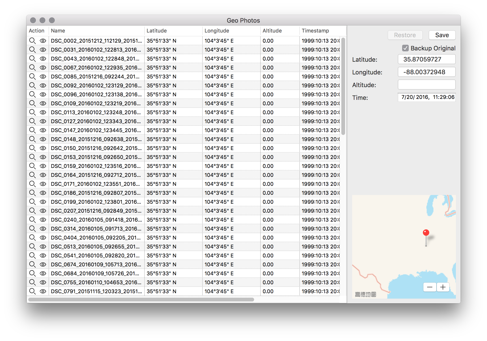
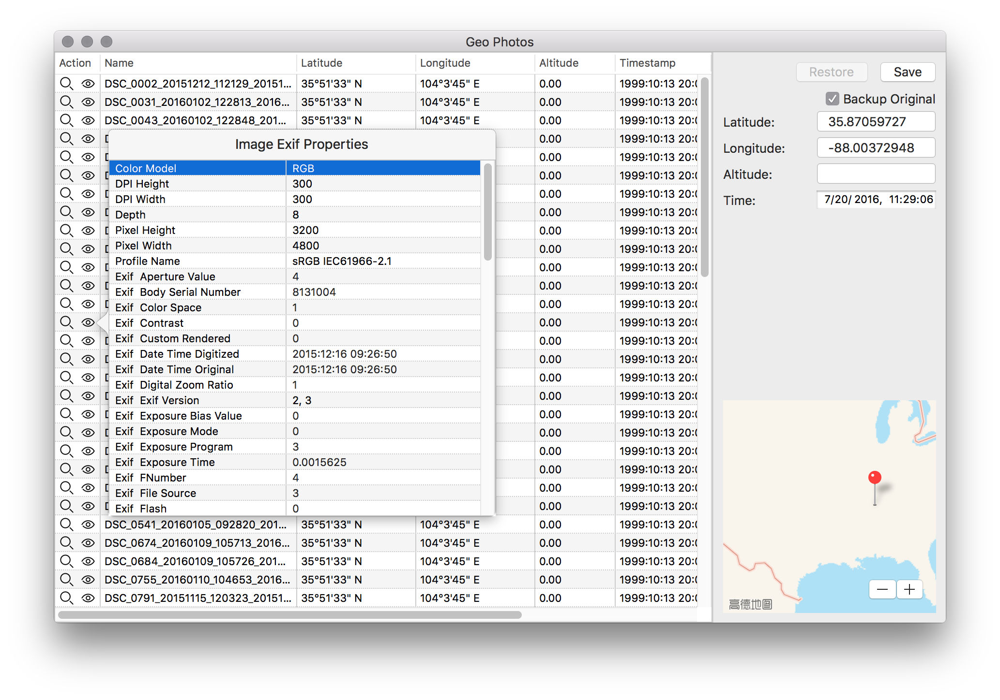
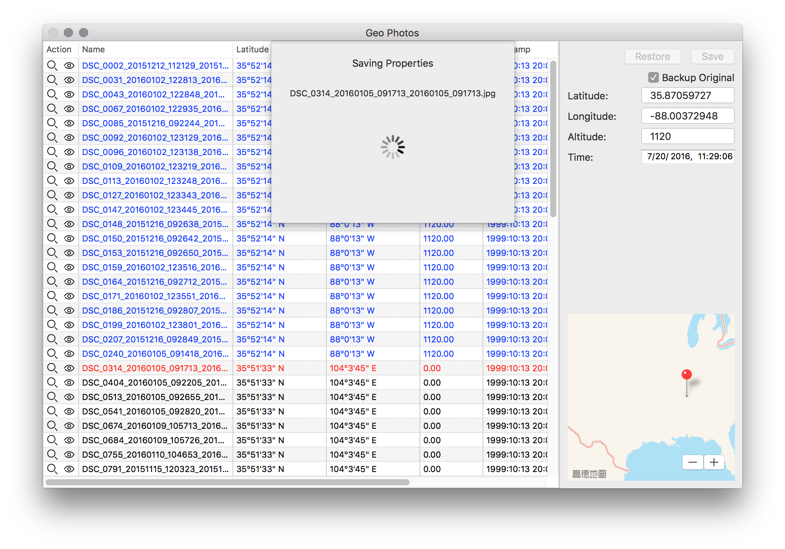
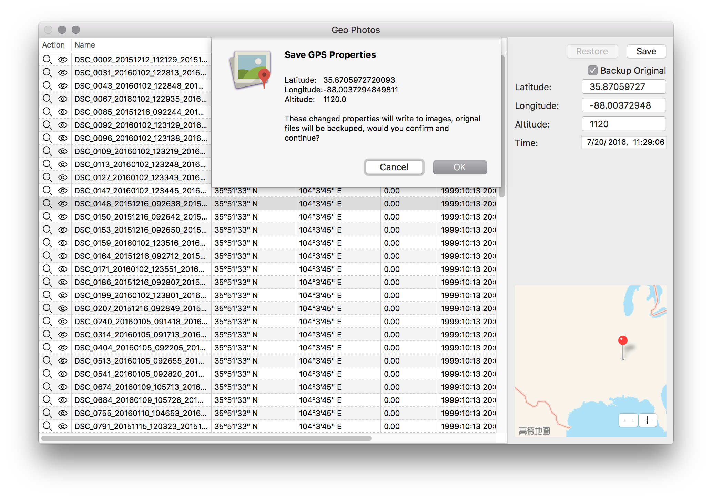

# GeoPhotos

Exif GPS metadata editor for macOS, written in Swift, support >= OS X 10.10.

## Downlaod 

Download on [Mac App Store](https://itunes.apple.com/cn/app/geophotos/id1136088196?mt=12)

## Development

```bash
// in terminal
pod install
open GeoPhotos.xcworkspace
```

## ScreenShots









## License

    This project is licensed under the terms of the GPLv3 license.

    Copyright (C) 2016 mcxiaoke github@mcxiaoke.com

    This program is free software: you can redistribute it and/or modify it under the terms of the GNU General Public License as published by the Free Software Foundation, either version 3 of the License, or (at your option) any later version.

    This program is distributed in the hope that it will be useful, but WITHOUT ANY WARRANTY; without even the implied warranty of MERCHANTABILITY or FITNESS FOR A PARTICULAR PURPOSE. See the GNU General Public License for more details.

    You should have received a copy of the GNU General Public License along with this program. If not, see http://www.gnu.org/licenses/.


